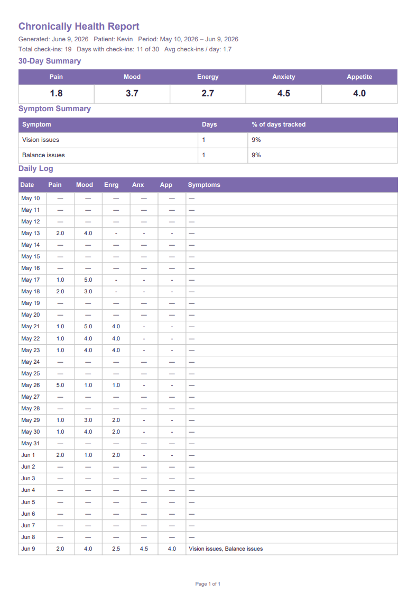

# Chronically

A daily health tracking app built for people living with chronic illness.

Chronically helps users log their pain, mood, energy, anxiety, and appetite through a simple step-by-step check-in, track symptoms over time, and spot patterns in their health data.

Built for my girlfriend, who has multiple sclerosis. 💙

**Live app:** [mychronically.app](https://mychronically.app)

---

## Screenshots




---

## What It Does

Chronically is designed for people who deal with chronic illness every day. On a bad pain day, the last thing you want is a complicated app. Chronically keeps it simple:

- **Daily check-in** — rate your pain, mood, energy, anxiety, and appetite through a simple step-by-step flow, no typing required. Check in every 4 hours to track how you feel throughout the day
- **Symptom tagging** — flag specific symptoms like fatigue, brain fog, pain flare, numbness, and more with a single tap
- **Encouraging feedback** — the app responds to how you're feeling with contextual messages at every step, acknowledging hard days and celebrating good ones
- **Trend tracking** — see how all five metrics correlate over time on a single graph, switchable between day, week, and month views
- **Medication tracking** — log your medications, track doses taken and skipped, and see today's full schedule at a glance
- **Pattern awareness** — circular stat dials show your 14-day averages alongside the most common symptoms
- **Doctor report** — export a one-page 30-day PDF report with averages, symptom breakdown, and a daily log — designed to bring to appointments
- **Full data control** — edit or delete check-ins, with all of today's entries visible at a glance
- **Secure accounts** — your health data stays private and belongs only to you

---

## Features

### Check-in

- 8-step check-in flow: Pain → Mood → Energy → Anxiety → Appetite → Symptoms → Review → Celebrate
- All interactions are button taps — no typing required
- Severity-first button order (worst option on the left, medical scale convention)
- Check in every 4 hours, multiple times per day
- Contextual toast messages respond to each selection — encouraging on hard readings, celebrating good ones
- Combined check-in toast on the review step based on overall pattern (2+ best, 2+ worst, etc.)
- 12 rotating affirmation messages on the celebration screen, written for chronic illness users
- Edit any of today's check-ins, delete only the most recent
- Fresh accounts show only the check-in prompt until the first check-in is logged

### Tracking

- Pain, mood, energy, anxiety, and appetite on a 1-5 wellness scale (5 = best for all metrics)
- Symptom tags: Fatigue 😴, Brain fog 🧠, Pain flare 🔥, Numbness 🥶, Spasticity ⚡, Vision issues 👁️, Heat sensitivity 🌡️, Balance issues 🌀
- Visual bar ratings in history — all metrics use green = better color coding
- Symptom emoji icons sit inline with stat bars in history entries
- 5 circular progress dials showing 14-day averages (responsive sizing)
- Common symptoms card shows top 3 symptoms with day count (3+ occurrence threshold)
- Correlation graph on the Trends page with Day / Week / Month tabs
- Y-axis labels: Good / Mid / Bad for easy reading
- Custom legend below graph (never overlaps tooltip)

### Medication Tracker

- Add medications with name, type (💊 pill / 💉 injection / 🩺 infusion / 🌿 supplement), dosage, frequency, scheduled times, and notes
- Frequencies: daily, twice daily, three/four times daily, every other day, weekly, biweekly, monthly, every X weeks, as needed
- Today's full medication schedule on the dashboard — all doses in a timeline
- Visual dose states: Upcoming / Past-due / Taken / Skipped / Missed
- Take and Skip buttons with skip reason dropdown (Forgot, Felt sick, Side effects, Ran out, Doctor advised, Already took it, Too painful to take)
- Undo button on taken and skipped entries for accidental logs
- Active/inactive toggle — inactive medications shown with reduced opacity
- Manage medications from the dedicated Medications page

### Doctor Report (PDF Export)

- One-page 30-day report generated in the browser via jsPDF
- Includes:
  - Patient name, date range, total check-ins, days tracked, avg check-ins per day
  - 5-metric summary averages
  - Full symptom breakdown — all 8 symptoms with day count and % of days tracked (day-based, not check-in-based)
  - Daily log table — one row per day, averaged across all check-ins that day
- Download from the Export Report button in the dashboard header
- File named `chronically-report-[username]-[date].pdf`

### Navigation

- Bottom tab bar on mobile (Dashboard / Trends / Medications / Profile)
- Hamburger menu on desktop
- Active page highlighted in primary purple

### Auth & Security

- User registration with email verification
- Login blocked until email is verified
- Forgot/reset password via email (1-hour token link, invalidated after use)
- Email verification on email address changes
- JWT authentication (30-day expiry)
- 14-day inactivity timeout
- BCrypt password hashing (10 salt rounds)
- Protected routes — all app pages require login
- Rate limiting on auth routes
- Delete account with confirmation modal (cascades all data)

### Email

- All transactional emails sent from `noreply@mychronically.app`
- Branded purple HTML templates via Resend
- Verification, password reset, and email change flows

---

## Tech Stack

**Frontend**

- React (Vite)
- React Router
- Axios
- DaisyUI (Tailwind CSS)
- React Icons
- Recharts
- react-circular-progressbar
- jsPDF + jspdf-autotable (PDF export)
- Google Fonts (Playfair Display + Lato)

**Backend**

- Node.js
- Express
- JWT (jsonwebtoken)
- BCrypt
- Resend (transactional email)

**Database**

- PostgreSQL
- Sequelize ORM
- Supabase (cloud hosting)

**Security**

- Helmet
- CORS
- express-rate-limit
- DotEnv

**Deployment**

- Render (frontend + backend)
- Supabase (PostgreSQL)
- Cloudflare DNS
- Custom domain: mychronically.app

---

## Project Structure

```
chronically/
├── client/                 (React frontend)
│   ├── public/
│   └── src/
│       ├── components/
│       │   ├── CheckInModal.jsx
│       │   ├── Navigation.jsx
│       │   └── ProtectedRoute.jsx
│       ├── context/
│       │   └── AuthContext.jsx
│       ├── hooks/
│       │   └── useAuth.js
│       ├── pages/
│       │   ├── LandingPage.jsx
│       │   ├── LoginPage.jsx
│       │   ├── RegisterPage.jsx
│       │   ├── ForgotPasswordPage.jsx
│       │   ├── ResetPasswordPage.jsx
│       │   ├── VerifyEmailPage.jsx
│       │   ├── DashboardPage.jsx
│       │   ├── TrendsPage.jsx
│       │   ├── MedicationsPage.jsx
│       │   └── ProfilePage.jsx
│       └── utils/
│           └── generateReport.js
├── server/                 (Express backend)
│   ├── config/
│   │   └── db.js
│   ├── controllers/
│   │   ├── authController.js
│   │   ├── checkInController.js
│   │   ├── userController.js
│   │   └── medicationController.js
│   ├── middleware/
│   │   └── auth.js
│   ├── models/
│   │   ├── User.js
│   │   ├── CheckIn.js
│   │   ├── Medication.js
│   │   └── MedicationLog.js
│   ├── routes/
│   │   ├── authRoutes.js
│   │   ├── checkInRoutes.js
│   │   ├── userRoutes.js
│   │   └── medicationRoutes.js
│   └── server.js
├── .gitignore
└── README.md
```

---

## Installation

### Prerequisites

- Node.js v18+
- PostgreSQL database (we use Supabase)
- Resend account (for transactional email)

### 1. Clone the repository

```bash
git clone https://github.com/kerkelenz/chronically.git
cd chronically
```

### 2. Install server dependencies

```bash
cd server
npm install
```

### 3. Install client dependencies

```bash
cd ../client
npm install
```

### 4. Set up environment variables

```bash
cd ../server
cp .env.example .env
```

Open `server/.env` and fill in your values:

```
PORT=3001
NODE_ENV=development
DATABASE_URL=your_postgres_connection_string
JWT_SECRET=your_jwt_secret_here
RESEND_API_KEY=your_resend_api_key
```

For the client create `client/.env`:

```
VITE_API_URL=http://localhost:3001
```

### 5. Set up the database

Create a PostgreSQL database (Supabase free tier). Add your connection string to `server/.env`. Sequelize will automatically create the tables when the server starts.

### 6. Run the application

In one terminal run the backend:

```bash
cd server
npm run dev
```

In another terminal run the frontend:

```bash
cd client
npm run dev
```

The app will be available at `http://localhost:5173`.

---

## Environment Variables

### Server (`server/.env`)

| Variable         | Description                                               |
| ---------------- | --------------------------------------------------------- |
| `PORT`           | Port the server runs on (default 3001)                    |
| `NODE_ENV`       | Environment (development or production)                   |
| `DATABASE_URL`   | PostgreSQL connection string                              |
| `JWT_SECRET`     | Secret key for signing JWT tokens (32+ random characters) |
| `RESEND_API_KEY` | API key for Resend transactional email                    |

### Client (`client/.env`)

| Variable       | Description                                                    |
| -------------- | -------------------------------------------------------------- |
| `VITE_API_URL` | Backend API URL (localhost for dev, Render URL for production) |

---

## API Endpoints

### Auth

| Method | Endpoint                        | Description                  | Auth Required |
| ------ | ------------------------------- | ---------------------------- | ------------- |
| POST   | /api/auth/register              | Create new account           | No            |
| POST   | /api/auth/login                 | Login to account             | No            |
| POST   | /api/auth/forgot-password       | Send password reset email    | No            |
| POST   | /api/auth/reset-password        | Reset password with token    | No            |
| POST   | /api/auth/validate-reset-token  | Validate reset token         | No            |
| POST   | /api/auth/verify-email          | Verify email address         | No            |

### Check-ins

| Method | Endpoint          | Description            | Auth Required |
| ------ | ----------------- | ---------------------- | ------------- |
| POST   | /api/checkins     | Create a check-in      | Yes           |
| GET    | /api/checkins     | Get all user check-ins | Yes           |
| PUT    | /api/checkins/:id | Update a check-in      | Yes           |
| DELETE | /api/checkins/:id | Delete a check-in      | Yes           |

### Users

| Method | Endpoint              | Description        | Auth Required |
| ------ | --------------------- | ------------------ | ------------- |
| PUT    | /api/users/profile    | Update profile     | Yes           |
| DELETE | /api/users/account    | Delete account     | Yes           |

### Medications

| Method | Endpoint                    | Description              | Auth Required |
| ------ | --------------------------- | ------------------------ | ------------- |
| GET    | /api/medications            | Get all medications      | Yes           |
| POST   | /api/medications            | Create medication        | Yes           |
| PUT    | /api/medications/:id        | Update medication        | Yes           |
| DELETE | /api/medications/:id        | Delete medication        | Yes           |
| GET    | /api/medications/logs       | Get logs for a date      | Yes           |
| POST   | /api/medications/logs       | Create log entry         | Yes           |
| PUT    | /api/medications/logs/:id   | Update log entry         | Yes           |
| DELETE | /api/medications/logs/:id   | Delete log entry (undo)  | Yes           |

---

## Database Schema

### Users

| Field               | Type    | Notes                                    |
| ------------------- | ------- | ---------------------------------------- |
| id                  | INTEGER | Primary key, auto increment              |
| username            | STRING  | Required, unique, 3-30 chars             |
| email               | STRING  | Required, unique, valid email            |
| password            | STRING  | Required, hashed with BCrypt (10 rounds) |
| isVerified          | BOOLEAN | Email verification status                |
| verificationToken   | STRING  | Email verification token                 |
| pendingEmail        | STRING  | New email awaiting verification          |
| resetPasswordToken  | STRING  | Password reset token                     |
| resetPasswordExpiry | DATE    | Password reset token expiry              |
| lastActive          | DATE    | For 14-day inactivity timeout            |
| createdAt           | DATE    | Auto-generated                           |
| updatedAt           | DATE    | Auto-generated                           |

### CheckIns

| Field         | Type     | Notes                                                  |
| ------------- | -------- | ------------------------------------------------------ |
| id            | INTEGER  | Primary key, auto increment                            |
| userId        | INTEGER  | Foreign key → Users.id                                 |
| painLevel     | INTEGER  | Required, 1-5 (5=very light, 1=very severe)            |
| moodLevel     | INTEGER  | Required, 1-5 (5=great, 1=very low)                    |
| energyLevel   | INTEGER  | Optional, 1-5 (5=full, 1=exhausted)                    |
| anxietyLevel  | INTEGER  | Optional, 1-5 (5=calm, 1=severe)                       |
| appetiteLevel | INTEGER  | Optional, 1-5 (5=great, 1=none)                        |
| symptoms      | JSON     | Optional, array of symptom strings                     |
| followUpData  | JSON     | Optional                                               |
| date          | DATEONLY | Required, sent from frontend as local date             |
| createdAt     | DATE     | Auto-generated                                         |
| updatedAt     | DATE     | Auto-generated                                         |

All five metrics use 5=best, 1=worst convention.

### Medications

| Field          | Type    | Notes                                                                    |
| -------------- | ------- | ------------------------------------------------------------------------ |
| id             | INTEGER | Primary key, auto increment                                              |
| userId         | INTEGER | Foreign key → Users.id                                                   |
| name           | STRING  | Required                                                                 |
| type           | ENUM    | pill / injection / infusion / supplement                                 |
| dosage         | STRING  | Optional, e.g. "20mg"                                                    |
| frequency      | ENUM    | daily / twice_daily / three_times_daily / four_times_daily /             |
|                |         | every_other_day / weekly / biweekly / monthly / every_x_weeks / as_needed|
| frequencyWeeks | INTEGER | Only used when frequency = every_x_weeks                                 |
| scheduledTimes | JSON    | Array of "HH:MM" strings                                                 |
| notes          | TEXT    | Optional                                                                 |
| active         | BOOLEAN | Default true                                                             |
| createdAt      | DATE    | Auto-generated                                                           |
| updatedAt      | DATE    | Auto-generated                                                           |

### MedicationLogs

| Field         | Type     | Notes                              |
| ------------- | -------- | ---------------------------------- |
| id            | INTEGER  | Primary key, auto increment        |
| userId        | INTEGER  | Foreign key → Users.id             |
| medicationId  | INTEGER  | Foreign key → Medications.id       |
| date          | DATEONLY | Date of the dose                   |
| scheduledTime | STRING   | "HH:MM" scheduled time             |
| takenAt       | DATE     | Actual timestamp when logged       |
| status        | ENUM     | taken / skipped / missed           |
| skipReason    | STRING   | Optional reason for skipping       |
| createdAt     | DATE     | Auto-generated                     |
| updatedAt     | DATE     | Auto-generated                     |

---

## Known Issues

- The free tier of Render spins down after inactivity — the first request may take up to 60 seconds while the server wakes up
- Graph requires at least 2 check-ins to show a meaningful line

---

## What's Next

- Streak and milestone celebrations
- Medications in PDF doctor report
- Push notifications for check-in and medication reminders
- Custom avatar upload
- Opt-in AI-generated personalized insights
- iOS app via React Native

---

## License

MIT