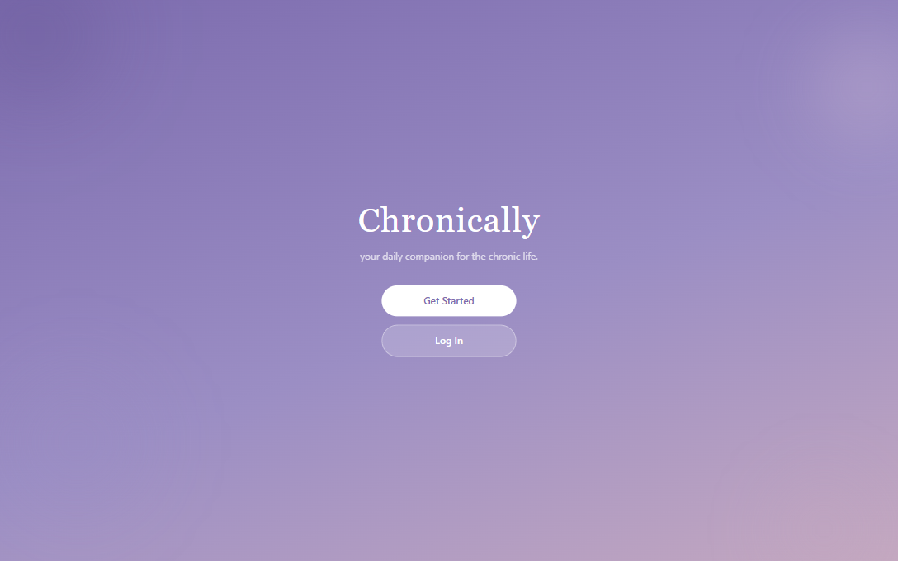
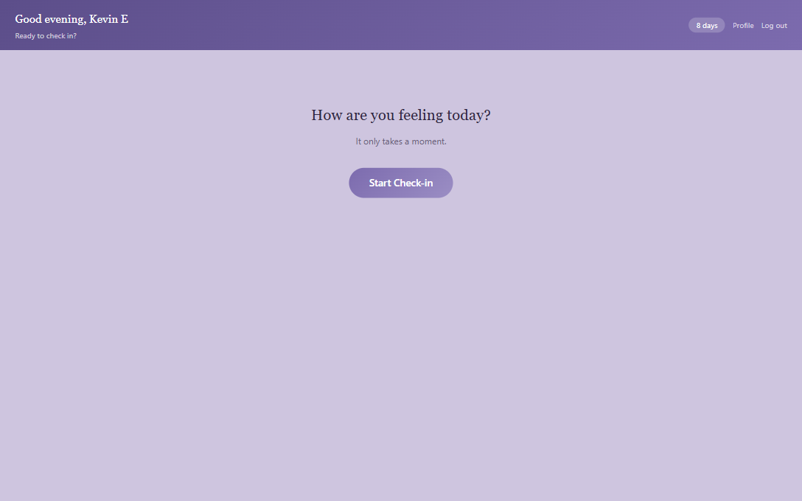
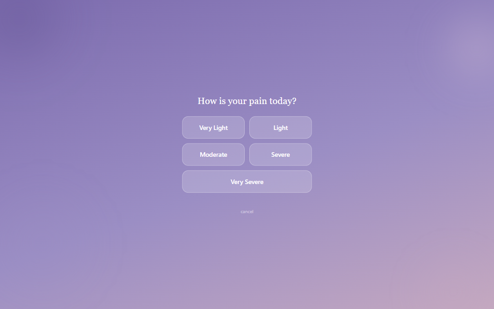
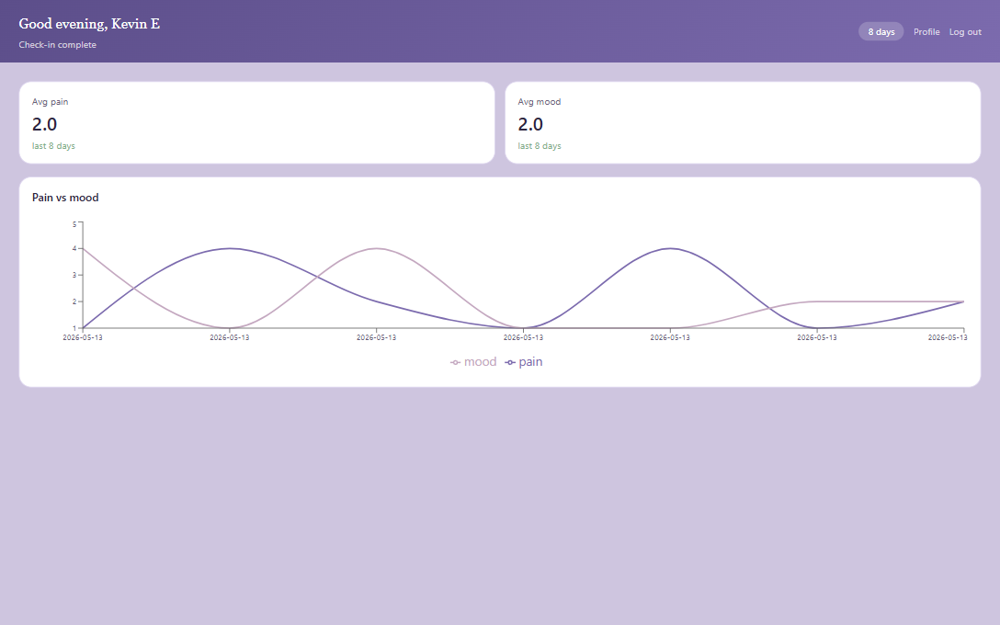
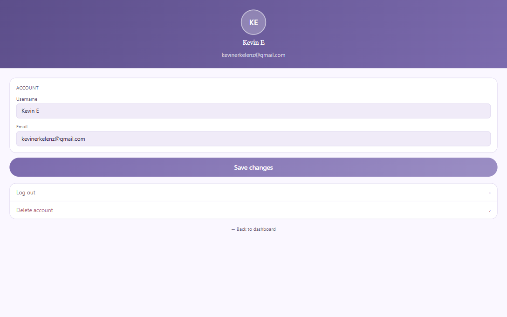

# Chronically

A daily health tracking app built for people living with chronic illness.

Chronically helps users log their pain and mood through a simple button-based check-in, receive personalized encouragement based on their history, and view their trends over time.

Built for my girlfriend, who has multiple sclerosis. 💙

**Live app:** [mychronically.app](https://mychronically.app)

---

## Screenshots

<!-- Add your screenshots here -->
<!-- Drag and drop images into this section or use the format below -->







---

## What It Does

Chronically is designed for people who deal with chronic illness every day. On a bad pain day, the last thing you want is a complicated app. Chronically keeps it simple:

- **Daily check-in** — rate your pain and mood with a single tap, no typing required
- **Trend tracking** — see how your pain and mood correlate over time on a single graph
- **Personalized insights** — the app learns your patterns and surfaces meaningful comparisons
- **Secure accounts** — your health data stays private and belongs only to you

---

## Features

- User registration and login with secure password hashing
- JWT authentication with session persistence across refreshes
- Daily check-in flow — pain level and mood level on a 1-5 scale
- Full screen check-in modal with step-by-step flow
- Edit and delete past check-ins
- Pain vs mood correlation graph with weekly/monthly/3-month views
- Average pain and mood stat cards
- User profile with editable username and email
- Responsive design — works on mobile and desktop
- Protected routes — dashboard and profile require login

---

## Tech Stack

**Frontend**

- React (Vite)
- React Router
- Axios
- DaisyUI (Tailwind CSS)
- React Icons
- Recharts

**Backend**

- Node.js
- Express
- JWT (jsonwebtoken)
- BCrypt

**Database**

- PostgreSQL
- Sequelize ORM
- Supabase (cloud hosting)

**Security**

- Helmet
- CORS
- express-rate-limit
- DotEnv

**Deployment**

- Render (frontend + backend)
- Supabase (PostgreSQL)
- Custom domain via Dreamhost

---

## Project Structure

```
chronically/
├── client/                 (React frontend)
│   ├── public/
│   └── src/
│       ├── components/
│       │   ├── CheckInModal.jsx
│       │   └── ProtectedRoute.jsx
│       ├── context/
│       │   └── AuthContext.jsx
│       ├── hooks/
│       │   └── useAuth.js
│       ├── pages/
│       │   ├── LandingPage.jsx
│       │   ├── LoginPage.jsx
│       │   ├── RegisterPage.jsx
│       │   ├── DashboardPage.jsx
│       │   └── ProfilePage.jsx
│       └── utils/
├── server/                 (Express backend)
│   ├── config/
│   │   └── db.js
│   ├── controllers/
│   │   ├── authController.js
│   │   ├── checkInController.js
│   │   └── userController.js
│   ├── middleware/
│   │   └── auth.js
│   ├── models/
│   │   ├── User.js
│   │   └── CheckIn.js
│   ├── routes/
│   │   ├── authRoutes.js
│   │   ├── checkInRoutes.js
│   │   └── userRoutes.js
│   └── server.js
├── .gitignore
└── README.md
```

---

## Installation

### Prerequisites

- Node.js v18+
- PostgreSQL database (we use Supabase)

### 1. Clone the repository

```bash
git clone https://github.com/kerkelenz/chronically.git
cd chronically
```

### 2. Install server dependencies

```bash
cd server
npm install
```

### 3. Install client dependencies

```bash
cd ../client
npm install
```

### 4. Set up environment variables

```bash
cd ../server
cp .env.example .env
```

Open `server/.env` and fill in your values:

```
PORT=3001
NODE_ENV=development
DATABASE_URL=your_postgres_connection_string
JWT_SECRET=your_jwt_secret_here
```

For the client create `client/.env`:

```
VITE_API_URL=http://localhost:3001
```

### 5. Set up the database

Create a PostgreSQL database (Supabase free tier in this case). Add your connection string to `server/.env`. Sequelize will automatically create the tables when the server starts.

### 6. Run the application

In one terminal run the backend:

```bash
cd server
npm run dev
```

In another terminal run the frontend:

```bash
cd client
npm run dev
```

The app will be available at `http://localhost:5173`.

---

## Environment Variables

### Server (`server/.env`)

| Variable       | Description                                               |
| -------------- | --------------------------------------------------------- |
| `PORT`         | Port the server runs on (default 3001)                    |
| `NODE_ENV`     | Environment (development or production)                   |
| `DATABASE_URL` | PostgreSQL connection string                              |
| `JWT_SECRET`   | Secret key for signing JWT tokens (32+ random characters) |

### Client (`client/.env`)

| Variable       | Description                                                    |
| -------------- | -------------------------------------------------------------- |
| `VITE_API_URL` | Backend API URL (localhost for dev, Render URL for production) |

---

## API Endpoints

### Auth

| Method | Endpoint           | Description        | Auth Required |
| ------ | ------------------ | ------------------ | ------------- |
| POST   | /api/auth/register | Create new account | No            |
| POST   | /api/auth/login    | Login to account   | No            |

### Check-ins

| Method | Endpoint          | Description            | Auth Required |
| ------ | ----------------- | ---------------------- | ------------- |
| POST   | /api/checkins     | Create a check-in      | Yes           |
| GET    | /api/checkins     | Get all user check-ins | Yes           |
| PUT    | /api/checkins/:id | Update a check-in      | Yes           |
| DELETE | /api/checkins/:id | Delete a check-in      | Yes           |

### Users

| Method | Endpoint           | Description    | Auth Required |
| ------ | ------------------ | -------------- | ------------- |
| PUT    | /api/users/profile | Update profile | Yes           |

---

## Database Schema

### Users

| Field     | Type    | Notes                                    |
| --------- | ------- | ---------------------------------------- |
| id        | INTEGER | Primary key, auto increment              |
| username  | STRING  | Required, unique, 3-30 chars             |
| email     | STRING  | Required, unique, valid email            |
| password  | STRING  | Required, hashed with BCrypt (10 rounds) |
| createdAt | DATE    | Auto-generated                           |
| updatedAt | DATE    | Auto-generated                           |

### CheckIns

| Field        | Type     | Notes                       |
| ------------ | -------- | --------------------------- |
| id           | INTEGER  | Primary key, auto increment |
| userId       | INTEGER  | Foreign key → Users.id      |
| painLevel    | INTEGER  | Required, 1-5 scale         |
| moodLevel    | INTEGER  | Required, 1-5 scale         |
| followUpData | JSON     | Optional                    |
| date         | DATEONLY | Required, defaults to today |
| createdAt    | DATE     | Auto-generated              |
| updatedAt    | DATE     | Auto-generated              |

---

## Known Issues

- The free tier of Render spins down after inactivity — the first request after a period of inactivity may take up to 60 seconds while the server wakes up
- Graph requires at least 2 check-ins to show a meaningful line

---

## What's Next

- Medication tracker
- Symptom tags (fatigue, brain fog, numbness, etc.)
- Doctor report export — generate a 30-day summary for appointments
- Push notifications for daily check-in reminders
- iOS app via React Native

---

## License

MIT
